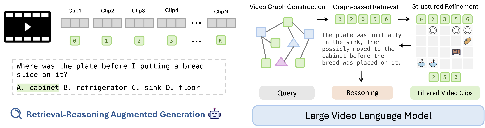
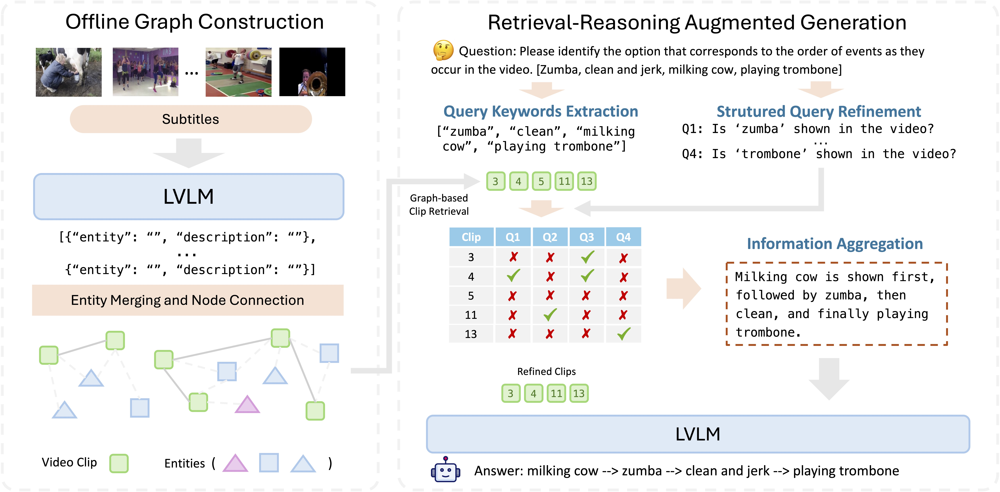

# Vgent

> Vgent: Graph-based Retrieval-Reasoning-Augmented Generation For Long Video Understanding
>
> *Xiaoqian Shen, Wenxuan Zhang, Jun Chen, Mohamed Elhoseiny*
> 
> []()
> [](https://xiaoqian-shen.github.io/Vgent)

## 🔍 Overview





## :rocket: Get Started

### ⚙️ Environment setup

```bash
git clone https://github.com/xiaoqian-shen/Vgent.git
cd Vgent
conda create -n vgent python==3.11
conda activate vgent
pip install -r requirements.txt
```
### 📊 Evaluation

Suggest to run on 8 A100 GPUs

Step1: Construct Offline Graph

```python 
torchrun \
    --nnodes=$SLURM_NNODES \
    --node_rank=$NODE_RANK \
    --master_addr=$MASTER_ADDR \
    --nproc_per_node=$SLURM_GPUS_ON_NODE \
    --master_port=$MASTER_PORT \
    -m vgent_graph \
    --model_name $model_name \ # qwenvl25_7b
    --task $task \ # mlvu, lvb, videomme
    --data_path $data_path \
```

Step2: Retrieval-Reasoning-Augmented Generation

```python
torchrun \
    --nnodes=$SLURM_NNODES \
    --node_rank=$NODE_RANK \
    --master_addr=$MASTER_ADDR \
    --nproc_per_node=$SLURM_GPUS_ON_NODE \
    --master_port=$MASTER_PORT \
    -m vgent_rag \
    --model_name $model_name \ # qwenvl25_7b
    --task $task \ # mlvu, lvb, videomme
    --data_path $data_path \
```

> [!Tip]
> You can add any LVLMs in Vgent pipeline by rewriting `load_video()`, `load_model()` and `mllm_response()`

## ✏️ Citation

If you find our paper and code useful in your research, please consider giving a star ⭐ and citation 📝:

```BibTeX
@inproceedings{shen2025vgent,
  title={Vgent: Graph-based Retrieval-Reasoning-Augmented Generation For Long Video Understanding},
  author={Shen, Xiaoqian and Zhang, Wenxuan and Chen, Jun and Elhoseiny, Mohamed},
  ournal={Advances in Neural Information Processing Systems},
  year={2025}
}
```
